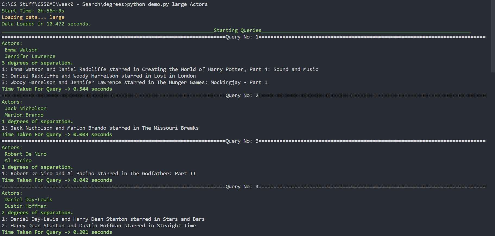

# Problem Set 0a - Degrees
This is an AI that finds the shortest kevin bacon degree between 2 actors from the IMDB dataset.

Usage for demo file:\
`python demo.py directory list`\
The directory is the dataset folder.\
The list is the comma-separated list of actors to search.\
&nbsp;&nbsp;&nbsp;&nbsp;Format: Jennifer Lawrence,Emma Watson