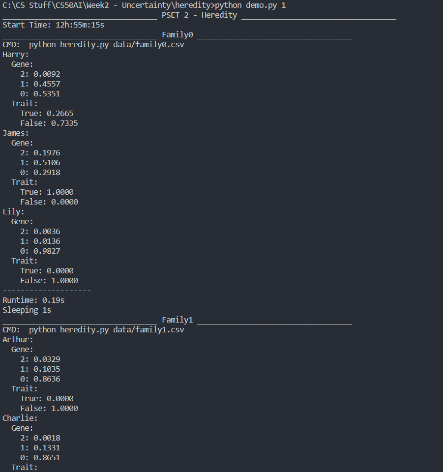

# Problem Set 2a - Heredity
This is an AI that finds the chances a gene per person in a family tree.

Usage for demo file:\
`python demo.py sleep_time`\
The `sleep_time` is the time (in seconds) between multiple the csv files in data folder.
