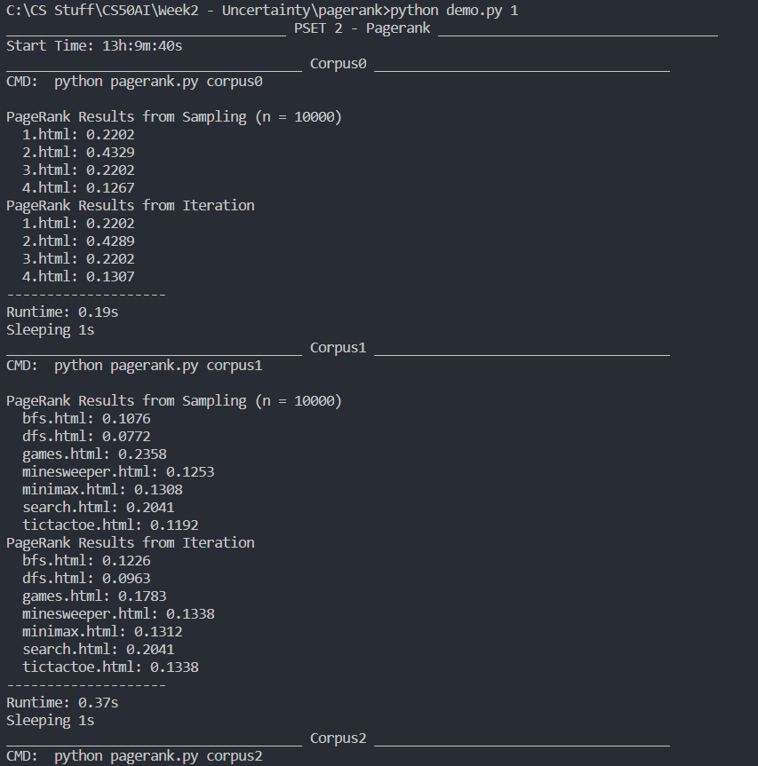
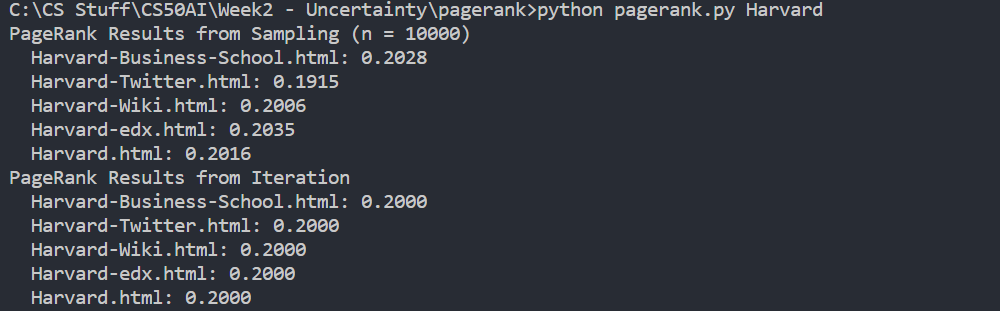
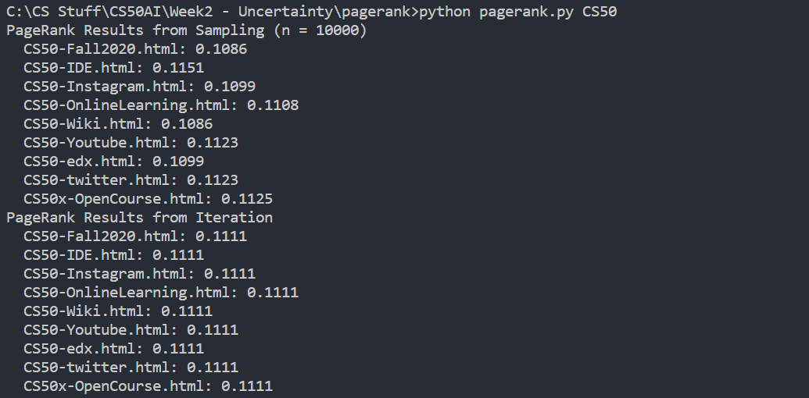

# Problem Set 2b - Pagerank
This is an AI algorithm for ranking web pages.






To use:
```
git clone https://github.com/freakingrocky/CS50AI.git
cd "CS50AI/Week2 - Uncertainty/pagerank"
python pagerank.py {corpus}
```

To use your own corpus:
<ol>
<li>Go to a website.</li>
<li>Add "view-source:" to the start of the URL.</li>
<li>Copy everything into a file.</li>
<li>Do the same with every webpage.</li>
<li>Put all the files in a directory and that directory is your corpus.</li>
</ol>