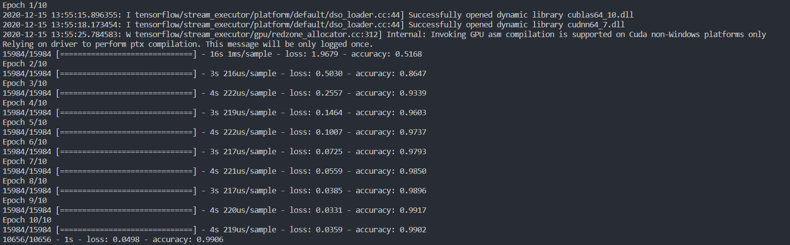

# Project 5 - Traffic
This is an image classification AI, classifying various traffic signs.



Usage:\
`python traffic.py data_directory`

# My Process
I started with the same model as in [handwriting.py](./other_files/handwriting.py) source code and went from there.

```python
    model = tf.keras.models.Sequential([
        tf.keras.layers.Conv2D(
            32, (3, 3), activation="relu", input_shape=(28, 28, 1)
        ),
        tf.keras.layers.MaxPooling2D(pool_size=(2, 2)),
        tf.keras.layers.Flatten(),
        tf.keras.layers.Dense(128, activation="relu"),
        tf.keras.layers.Dropout(0.5),
        tf.keras.layers.Dense(10, activation="softmax")
    ])
    model.compile(
        optimizer="adam",
        loss="categorical_crossentropy",
        metrics=["accuracy"]
    return model
```

I took a step by step process going from the convolution layer to the training.

I started to read the tensorflow documentation and watched a few youtube videos to understand the module better.

#### Convolutional Layers
I researched online about the conventional settings and read what each line of code does and then experimented with it. The first thing I did was add [1][df1] more convolutional layer and experimented with the filters and activation function. At the end, I found that [43][df1] filters work the best. The activation function was a tie between [relu][df1] ad [elu][df1]. I just ended up sticking with [relu][df1] since it is linear and a bit more efficient. At the end, after experimentation, I ended up with [3][df1] convolutional layers.
```python
        tf.keras.layers.Conv2D(
            43, (3, 3), activation="relu",
            input_shape=(IMG_WIDTH, IMG_HEIGHT, 3)
        ),
        tf.keras.layers.Conv2D(
            43, (3, 3), activation="relu",
            input_shape=(IMG_WIDTH, IMG_HEIGHT, 3)
        ),
         tf.keras.layers.Conv2D(
            43, (3, 3), activation="relu",
            input_shape=(IMG_WIDTH, IMG_HEIGHT, 3)
        ),
```
#### Pooling Layer
After this, I moved onto the pooling layer, I experimented with it and found that a [3*3][df1] matrix works best.
```python
        tf.keras.layers.MaxPooling2D(pool_size=3),
        tf.keras.layers.Flatten(),
```

#### Hidden Layers
Next were the hidden layers. Here's where things got interesting. I understood what it did but there was no real way for me to know what would be the best configuration for this project. I started by adding  [5][df1] more layers, not counting the final layer, but after some experimentation, I settled on [2][df1], each with [200][df1] units. Both with [relu][df1] activation functions, though [elu][df1] had very similar results. Each layer has a dropout of [10%][df1] to combat overfitting. I experimented a little bit with the final layer but ended up on the same configuration as I started.
```python
        tf.keras.layers.Dense(200, activation="relu"),
        tf.keras.layers.Dropout(0.1),
        tf.keras.layers.Dense(200, activation="relu"),
        tf.keras.layers.Dropout(0.1),

        # Final Layer
        tf.keras.layers.Dense(NUM_CATEGORIES, activation="softmax")
```
Even though it seemed like a good idea to just throw in many layers, hoping to increase accuracy, it's not.

#### Training
I researched the optmizers on https://keras.io/api/optimizers/ and I was curious about the results of [adamax][df1] and [Nadam][df1], apart from [adam][df1] which was what I started with. [Nadam][df1] had similar results to [adam][df1] but [adamax][df1] outperformed it and gave almost an extra percent. I tried it out just out of curiosity but I'm guessing this improvement is because [adamax][df1] uses the infinity norm, which gives the maximum element in the vector. Thus, [adamax][df1] updates the maximum between the past and current gradient. This results in [adamax][df1] reducing gradient noise, especially for greater gradient swings.
```python
    model.compile(
        optimizer="adamax",
        loss="categorical_crossentropy",
        metrics=["accuracy"]
    )
```
Throughout the whole process I was surprised by the results many times. It helped me to understand some of the concepts a lot better.

### Final Results
The results range from 98.34% - 99.16% [in 100 runs]

The best result I got was 99.16%


   [df1]: <>