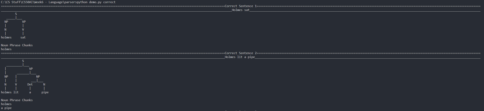
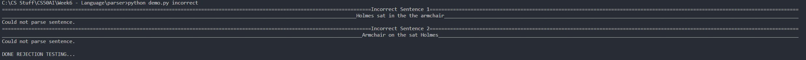

# Problem Set 6a - Parser
AI to parse sentences.





Usage:\
`python parser.py {sentence_file}`

Usage for demo file:\
`python demo.py {correct/incorrect}`

To use locally:
```cmd
git clone https://github.com/freakingrocky/CS50AI.git
cd "CS50AI/Week6 - Language/parser"
python parser.py {sentence_file}
```